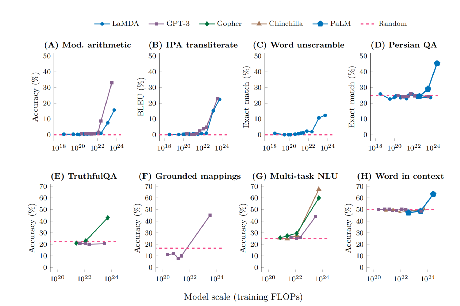

这篇论文《Are Emergent Abilities of Large Language Models a Mirage?》 是 nips2023 Outstanding Paper。

### 🚀简介：
 emergence abilities
 
“LLM的涌现能力”被定义为“在较小规模模型中不存在但在大规模模型中存在的能力。因此，无法通过简单地推断在较小规模模型上的性能改进来预测它们”。这样的能力最初是在GPT-3系列模型中发现的。随后的研究强调了这一发现，指出“尽管模型在一般层面上的性能是可预测的，但在特定任务上，性能有时会在尺度上以令人难以预测和突然的方式出现”。涌现能力的神奇之处就在于两点：第一，非光滑，似乎它们瞬间从不存在变为存在；第二，不可预测性，不知道在什么规模的模型上就突现了。

涌现能力相关的讨论在大模型出圈之后一直被津津乐道，尤其是在训练出的模型能力不达预期时，时常背锅：可能是模型不够大，所以不具备这样的能力。问题来了，涌现能力是否真的是大规模模型才拥有的魔法？

这篇论文提出了对涌现能力的一种解释：对于特定任务和模型，在分析模型输出时，涌现能力的出现是由于研究人员选择的衡量指标所致，而非模型行为随着规模扩大而发生了根本性变化。具体而言，非线性或不连续（不光滑）的衡量标准会产生明显的涌现能力，而线性或连续的度量标准会导致模型性能的平滑、连续、可预测的变化。

#### 1.是什么决定了涌现哪些能力？
#### 2.是什么决定了何时涌现？
#### 3.如何让期待的能力更快出现，并确保不良的能力永远不会出现？

### ⭐解释：

#### 答案是选择非线性或不连续的度量标准的原因

具体的讲解，可以看博客 https://finisky.github.io/llm-emergent-ability-is-mirage-summary/