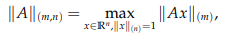
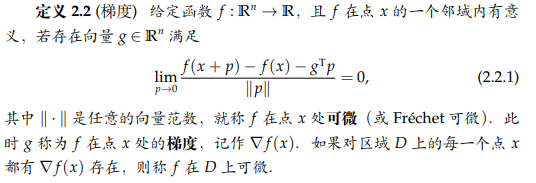
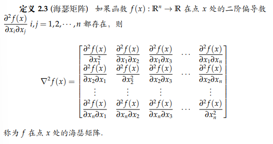
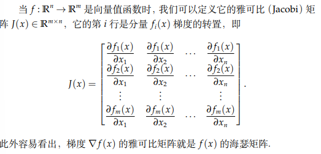
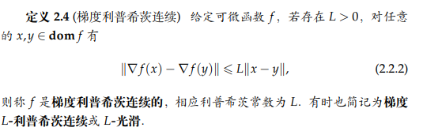
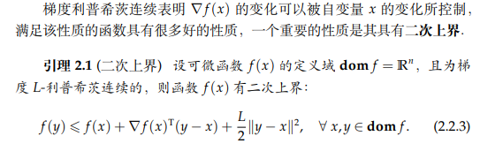
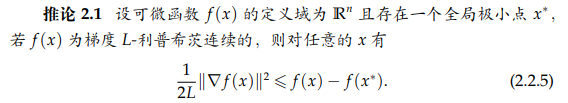
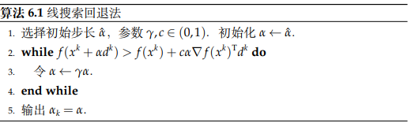

# 基础知识
## 范数
#### 内积的性质：

1.非负性：$\lt x,x\gt \geq 0 $,if  and only if  x=0,$\lt x,x\gt=0$

2.对称性：$\lt x,y \gt =\lt y,x\gt$

3.齐次性：$\lt ax,y\gt=a\lt x,y\gt$

4.可加性：$\lt x+y,z\gt=\lt x,z\gt+\lt y,z\gt$

#### $l_p$范数

$$||x||_p：=（|x_1|^p+|x_2|^p+...+|x_n|^p）^{1/p}$$

when $p=2$,

$$||x||:= (<x,x>)^{1/2}$$

when $p=\infty$,

$$||x||_{\infty}=max|x_i|$$

#### 柯西-施瓦兹不等式
$$|\lt x,y \gt |\leq||x||*||y||$$

*proof*：

不妨令x,y为单位向量
    $$0\leq||x-y||^2=\lt x-y,
    x-y\gt=2-2\lt x,y\gt$$

得到
    $$<x,y>\leq1$$
$将x/||x||，y/||y||代入其中，再根据齐次性，得到<x,y>\leq||x||*||y||，以-x代替x得到<x.y>\geq-||x||*||y||$

*proved*

#### 矩阵范数
the same as vectors,
$A_{m*n}的1-范数是A中所有元素绝对值的总和，F范数是(tr（A*A^T）)^{1/2},是(奇异值平方和)^{1/2},2-范数是最大奇异值$

but the differently,

**算子范数**：

$where||*||_{m} $ is  the   norm   from  $R^{m}$ 

when m=n=p,got $l_p$ norm。$l_2$ norm is often used,the $l_2$ norm of matrix is its **max singular value**

for all 算子norm：
$||Ax||_{m}\leq||A||_{m,n}||x||_{n}$

**ker-norm(核范数)**：
$||A||_{*}=\sum\sigma_i$,where
$\sigma_i$ is the **nozero singular value**. 

We often constrain $||*||_{*}$to  ensure matrix **low-rank** like constraining $||*||_{1}$ to ensure vetcors **sparsity**(保证稀疏性)

**矩阵内积(Frobenius内积)**
$<A,B>:=tr(AB^{T})=\sum\sum a_{ij}b_{ij}$

柯西-施瓦兹不等式 is also satisfied.
$$|<A,B>|\leq||A||_{F}*||B||_{F}$$

## 导数（derivative）
**gradient**

we usually see gradient as a vetcor

**proof**:
let define a function:$g（t）=f(x+t(y-x)),t\in [0,1]$

$f(y)-f(x)-\nabla f(x)^T(y-x)=\int_{0}^{1} g^1(t)- g^1(0) dt$
$=\int_{0}^{1} (\nabla f(x+t(y-x))-\nabla f(x))(y-x)^Tdt$
$\leq\int_{0}^{1} |\nabla f(x+t(y-x))-\nabla f(x)|*|x-y|dt$

$\leq \int_{0}^{1} Lt|y-x|^2dt=\frac{L}{2}|y-x|^2$

**proved.**

tips:**L-smooth** is telling ,the increasing speed of $f$ is dominant by a type of $x^2$ function.

**proof**:

$f(x^*)\leq f(y)\leq f(x)+\nabla f(x)^T(y-x)+\frac{L}{2}||y-x||^2$
the right-side have  $inf$ ,when $y=x-\frac{\nabla f(x)}{L}$
$f(x^*)<f(x)-\frac{1}{2L}||\nabla f(x)||^2$

**proved.**

# 无约束优化
### 线搜索方法

$x^{k+1}=x^{k}+a_kd^{k}$,where **d** represents the **search direction**,**a** represents the **step length**.

$d^{T}\nabla f(x^{k})<0$ is  wanted (**down**)

we put more attention to how to choose **$a_k$**(**step-length**)

exact line search criteria:

$$a_k=arg min_{a>0}f(x^k+ad^k)$$

but no-exact line search criteria is more used/popluar:

#### **Armijo criteria**:
$$f(x^k+ad^k)\leq f(x^k)+c_1a\nabla f(x^k)^Td^k,where~~ c_1\in(0,1)$$

tips: when $a$ or $c_1$ is small ,Armijo criteria is easy to st.
To speed up convergence,**a（step-length）** can't be too small!

here is a easy way to find good **$a_k$**

#### **Goldstein criteria**:

$$f(x^k+ad^k)\leq f(x^k)+ca  \nabla f(x^k)^Td^k$$
$$f(x^k+ad^k)\geq f(x^k)+(1-c)a  \nabla f(x^k)^Td^k$$

where $c\in(0,0.5)$

tips:base on **Armijo criteria**,discard some **a（step-length）** which is too small.

#### **Wolfe criteria**:
$$f(x^k+ad^k)\leq f(x^k)+c_1a  \nabla f(x^k)^Td^k$$

$$\nabla f(x^k+ad^k)^Td^k\geq c_2\nabla f(x^k)^Td^k$$

where $c_1,c_2\in(0,1),c_1<c_2$

tips:2nd is more important.

when $x^k $ is $ x^*$,$\nabla f(x^k)=0$,(2nd is st.)

$\nabla f(x^k+ad^k)\geq c_2\nabla f(x^k)$

 when **$c_1$ is small,$c_2$ is big**, this criteria is more easy to st.

### 梯度类方法（gradient method）
#### 最速下降法
$$x_{k+1}=x_k-a_k\nabla f(x^k)$$
$$a_k=argmin_{a\geq 0}f(x^k+a\nabla f(x^k))$$

#### the convergence analysis（收敛性分析）
let define:
 $$f(X)=\frac{1}{2}x^TQx-b^Tx$$
$$V(X)=f(x)+\frac{1}{2}x^{*T}Qx^*=\frac{1}{2}(x-x^*)^TQ(x-x^*),where:QX^*=b $$

proof:
    $V(x^{k+1})=\frac{1}{2}(x^{k+1}-x^*)^TQ(x^{k+1}-x^*)$
    $=\frac{1}{2}$

待续

### 共轭类方法（Conjugate Gradient Method）
if there exist a equation $AX=b$,we can solve it by solving the optimization question 
$$arg~min_{X}~~ g(x)=\frac{1}{2}X^TAX-b^TX$$

because $g(x)$ is convex-function,whose solution $x^*$($ Ax^*-b=g^{1}(x^*)=0 $)
#### Conjugate Direction Method

we define {$p_i$} is conjugate (regarding matrix A) ,if $$p_i^TAp_j=0~~~for~~ all ~~i\ne j$$

for given $x_0\in R^n$ and conjuate direction {$p_1,p_1,..,p_n$},the method as below:

$$x_{k+1}=x_{k}+\alpha_{k+1}p_{k+1}\\
\alpha_{k+1}=arg~~min_{\alpha}~~g(x_k+\alpha p_{k+1})\\
\alpha_{k+1}=-(Ax_k-b)^Tp_{k+1} /(p_{k+1}^TAp_{k+1})$$

**proof:**

$x^*-x_0=\sigma_1p_1+...+\sigma_np_n~~~~~~~~~~~~~~(1)$

$p_k^TA（x^*-x_0）=\sigma_k p_k^TAp_k~~~~~~~~~~~~~(2)$

$p_k^TA（x_{k-1}-x_0）=0~~~~~~~~~~~~~~~~~~~~~~(3)$

$$p_k^TA（x^*-x_0）=p_k^TA（x^*-x_{k-1}）=p_k^T（b-Ax_{k-1}）
\\=\alpha_k p_k^TAp_k$$

so got $\alpha_k=\sigma_k$

**proved.**

